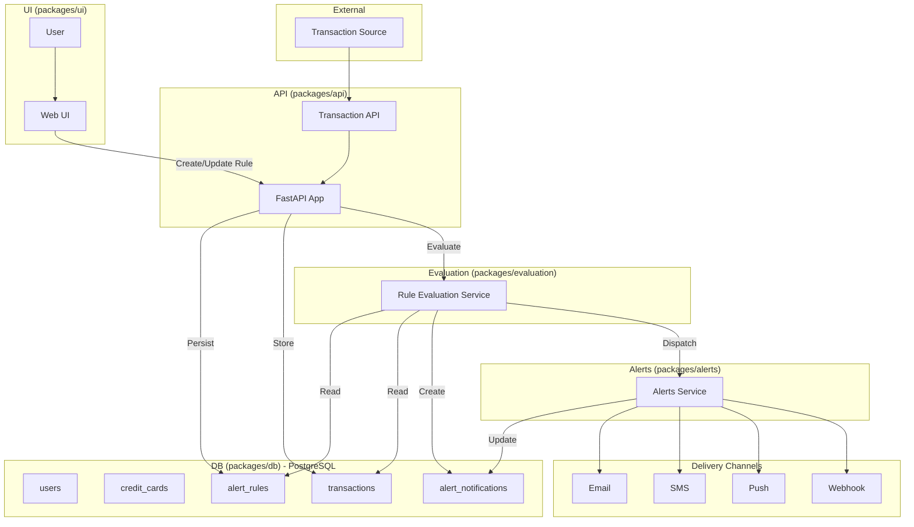
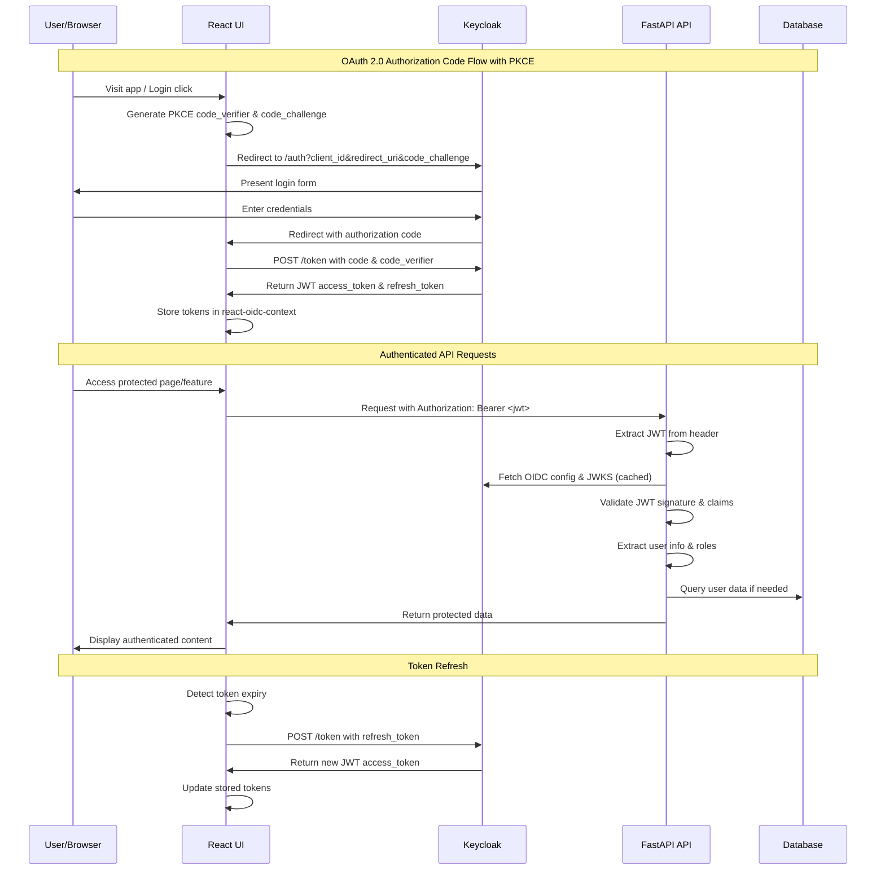

<!-- omit from toc -->
# Spending Transaction Monitor

Alerting for credit card transactions with rule-based and future natural-language rules.

For contribution guidelines and repo conventions, see [CONTRIBUTING.md](CONTRIBUTING.md).
<!-- omit from toc -->
## Table of contents

- [Overview](#overview)
- [How it works](#how-it-works)
- [Getting started](#getting-started)
- [Components](#components)
- [Standards](#standards)
- [Releases](#releases)
- [Structure](#structure)

## Overview

- Monorepo managed with Turborepo
- UI: React + Vite
- API: FastAPI (async SQLAlchemy)
- DB: PostgreSQL with SQLAlchemy models and Alembic migrations

Packages
- `packages/ui`: web app and Storybook
- `packages/api`: API service and routes
- `packages/db`: models, engine, Alembic, seed/verify scripts
- `packages/evaluation`: rule evaluation (scaffold)
- `packages/alerts`: alert delivery (scaffold)
- `packages/configs/*`: shared ESLint/Prettier configs

## How it works

- Users create alert rules (amount, merchant, category, timeframe, location; notification methods: email/SMS/push/webhook).
- Incoming transactions are stored and evaluated against active rules.
- Triggered rules produce alert notifications which are delivered via configured channels.



## Getting started

Prerequisites: Node 18+, pnpm 9+, Python 3.11+, uv, Podman (preferred) or Docker

Install
```bash
pnpm setup
```

Develop (starts DB, API, UI)
```bash
pnpm dev
```

Common tasks
```bash
pnpm build
pnpm test
pnpm lint
pnpm format
pnpm db:revision
pnpm db:verify
```

Dev URLs
- Web UI: http://localhost:5173
- API: http://localhost:8000
- API Docs: http://localhost:8000/docs
- Component Storybook: http://localhost:6006

Manual DB control (optional)
```bash
pnpm db:start    # podman compose (fallback to docker compose)
pnpm db:upgrade
pnpm db:seed
pnpm db:stop
```

Python virtual environments
```bash
# Each Python package uses uv-managed venvs under the package directory
pnpm --filter @spending-monitor/api install:deps
pnpm --filter @spending-monitor/db install:deps
```


## Authentication

The system uses **OAuth 2.0 / OpenID Connect** with Keycloak for authentication and authorization.

### Authentication Flow



### Quick Setup

1. **Start Authentication Services**
   ```bash
   cd packages/auth
   make services-up
   ```

2. **Setup Keycloak Realm and Client (Automated)**
   ```bash
   cd packages/auth/scripts
   python3 setup_keycloak.py
   ```
   
   This script will:
   - Create the `spending-monitor` realm
   - Configure the `spending-monitor` client with proper OIDC settings
   - Create test users: `testuser@example.com` (password: `password123`)
   - Set up user and admin roles
   - Enable OIDC discovery endpoint

3. **Manual Setup (Alternative)**
   If the automated setup fails, you can configure manually:
   - Go to http://localhost:8080
   - Login with `admin/admin`
   - Create realm `spending-monitor`
   - In spending-monitor realm, create client `spending-monitor`:
     - Client type: `OpenID Connect`
     - Client ID: `spending-monitor`
     - Valid Redirect URIs: `http://localhost:5173/*`
     - Web Origins: `http://localhost:5173`
     - Access Type: `public` (PKCE enabled)
   - Create test user: `testuser@example.com` / `password123`
   - Create roles: `user`, `admin` and assign to user

4. **Test Authentication**
   ```bash
   # Run E2E tests to verify setup
   cd packages/auth
   make test-e2e
   ```

### Architecture Components

- **Frontend**: React with `react-oidc-context` for OAuth handling
- **Backend**: FastAPI with JWT validation middleware using `python-jose`
- **Identity Provider**: Keycloak (`spending-monitor` realm)
- **Token Storage**: Browser session storage via react-oidc-context
- **Security**: PKCE, RS256 signatures, role-based authorization

### Development Commands

```bash
# Authentication-specific commands (from packages/auth/)
make auth-up         # Start Keycloak only
make db-up           # Start database only  
make services-up     # Start all services (Keycloak + DB)
make test-unit       # Run auth middleware unit tests
make test-e2e        # Run end-to-end auth tests
make auth-setup      # Show Keycloak setup instructions

# Setup scripts (from packages/auth/scripts/)
python3 setup_keycloak.py  # Automated realm/client/user creation
```

### Prerequisites for Authentication

The automated setup script requires:
- Keycloak running on http://localhost:8080
- Admin credentials: `admin/admin` (default from compose.yml)
- Python 3.11+ with `requests` library

If the setup script fails, check:
1. Keycloak is accessible at http://localhost:8080
2. Admin console loads at http://localhost:8080/admin
3. No network connectivity issues to localhost

### API Endpoints

Demo endpoints showing different authentication levels:

- `GET /auth-demo/public` - No authentication required
- `GET /auth-demo/profile` - Optional authentication (personalized if logged in)
- `GET /auth-demo/protected` - Authentication required
- `GET /auth-demo/user-only` - Requires `user` role or higher
- `GET /auth-demo/admin-only` - Requires `admin` role
- `GET /auth-demo/token-info` - Shows JWT token details (authenticated)


## Components

- API (`packages/api`): health, users, transactions; async DB session; foundation for rule evaluation and NLP integration
- DB (`packages/db`): SQLAlchemy models, Alembic migrations, seed/verify; local Postgres via Podman/Docker
- UI (`packages/ui`): React app and components in Storybook

## Standards

- Conventional Commits; commitlint enforces messages
- Branch names must match: `feat/*`, `fix/*`, `chore/*`, `docs/*`, `refactor/*`, `test/*`, `ci/*`, `build/*`, `perf/*`
- Hooks
  - pre-commit: UI Prettier/ESLint; API Ruff format/check on staged files
  - pre-push: format:check, lint, test; commitlint on commit range; branch name check

## Releases

Automated with semantic-release on CI, using commit messages to drive versioning and changelogs. Configuration in `.releaserc`.

## Structure

```
spending-transaction-monitor/
├── packages/
│   ├── api/
│   ├── db/
│   ├── ui/
│   └── configs/
├── docs/
├── turbo.json
├── pnpm-workspace.yaml
└── package.json
```
